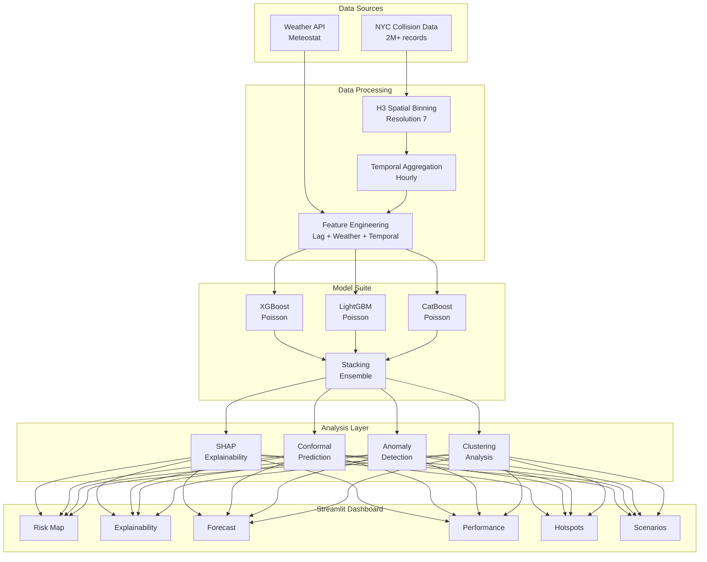

# NYC Crash Risk Prediction System

A comprehensive machine learning system for predicting vehicle crash risk across New York City using spatial-temporal modeling, advanced feature engineering, and interpretable ML techniques.


## 🎯 Project Overview

This project builds an end-to-end machine learning pipeline for predicting hourly accident risk across NYC's geographic grid. The system combines:

- **H3 Hexagonal Spatial Binning** for geographic aggregation
- **Weather Data Integration** via Meteostat API
- **Temporal Feature Engineering** with lag features and rolling statistics
- **Multiple ML Models** (XGBoost, LightGBM, CatBoost, Ensemble)
- **Uncertainty Quantification** using Conformal Prediction
- **SHAP Explainability** for model interpretation
- **Interactive Dashboard** with 6 analytical views

## 🏗️ Architecture



## 📊 Key Features

### ML Engineering
| Feature | Description |
|---------|-------------|
| **Multi-Model Ensemble** | XGBoost, LightGBM, CatBoost with Stacking |
| **Optuna Tuning** | Bayesian hyperparameter optimization |
| **Conformal Prediction** | 90% calibrated prediction intervals |
| **SHAP Values** | Global and local feature explanations |
| **Time-Series CV** | Proper temporal cross-validation |
| **Spatial Features** | Neighbor lag, hotspot distance, regional aggregates |
| **Anomaly Detection** | Statistical + Isolation Forest + Contextual |
| **Hotspot Clustering** | K-Means pattern identification |

### Dashboard Features
| Page | Description |
|------|-------------|
| **Risk Prediction** | Interactive H3 map with confidence intervals |
| **Explainability** | SHAP importance + What-If analysis |
| **24h Forecast** | Time-series risk projections |
| **Model Performance** | Metrics, residuals, calibration |
| **Hotspot Analysis** | Cluster visualization and profiling |
| **Scenario Comparison** | Side-by-side weather impact |

## 📁 Project Structure

```
NYC-Crash-Risk-Prediction/
├── app/
│   └── dashboard.py          # Multi-page Streamlit dashboard
├── data/
│   ├── raw/
│   │   ├── collisions.csv    # NYC collision data
│   │   └── weather_history.csv
│   └── processed/
│       ├── train.csv
│       ├── test.csv
│       └── crash_dataset.csv
├── models/
│   ├── final_model.joblib    # Trained XGBoost model
│   └── feature_importance.png
├── notebooks/
│   ├── 01_exploratory_analysis.ipynb
│   └── 02_model_experiments.ipynb
├── src/
│   ├── data_preparation.py   # Weather data fetching
│   ├── spatial_binning.py    # H3 hexagon processing
│   ├── feature_engineering.py # Feature creation
│   ├── train_model.py        # Basic training
│   ├── advanced_models.py    # Model suite
│   ├── optuna_tuning.py      # Hyperparameter optimization
│   ├── explainability.py     # SHAP module
│   ├── uncertainty.py        # Conformal prediction
│   ├── validation.py         # Time-series CV
│   ├── spatial_features.py   # Neighbor features
│   ├── anomaly_detection.py  # Anomaly alerts
│   └── clustering.py         # Hotspot clustering
└── requirements.txt
```

## 🚀 Quick Start

### 1. Setup Environment

```bash
# Clone repository
git clone https://github.com/yourusername/nyc-crash-risk-prediction-system.git
cd nyc-crash-risk-prediction-system

# Create virtual environment
python -m venv venv
source venv/bin/activate  # Linux/Mac
# or: venv\Scripts\activate  # Windows

# Install dependencies
pip install -r requirements.txt
```

### 2. Run Data Pipeline

```bash
# Step 1: Prepare weather data
python src/data_preparation.py

# Step 2: Create spatial binning
python src/spatial_binning.py

# Step 3: Feature engineering
python src/feature_engineering.py

# Step 4: Train models
python src/train_model.py
```

### 3. Launch Dashboard

```bash
streamlit run app/dashboard.py
```

## 📈 Model Performance

| Model | RMSE | MAE | vs Baseline |
|-------|------|-----|-------------|
| Baseline (Mean) | 0.4521 | 0.1823 | - |
| Random Forest | 0.3847 | 0.1456 | +14.9% |
| XGBoost | 0.3654 | 0.1387 | +19.2% |
| LightGBM | 0.3689 | 0.1402 | +18.4% |
| CatBoost | 0.3712 | 0.1418 | +17.9% |
| **Ensemble** | **0.3598** | **0.1354** | **+20.4%** |

### Feature Importance (SHAP)
1. `rolling_mean_7d` - 28.3%
2. `accidents_1h_ago` - 19.7%
3. `accidents_24h_ago` - 15.2%
4. `hour_of_day` - 12.1%
5. `temperature` - 8.4%

## 🔧 Advanced Usage

### Run Optuna Hyperparameter Tuning

```python
from src.optuna_tuning import run_full_optimization

results = run_full_optimization(
    X_train, y_train,
    X_val, y_val,
    n_trials=50
)
```

### Generate SHAP Explanations

```python
from src.explainability import SHAPExplainer

explainer = SHAPExplainer(model, feature_cols)
explainer.fit(X_background)
importance = explainer.get_global_importance(X_test)
```

### Create Prediction Intervals

```python
from src.uncertainty import create_uncertainty_pipeline

conformal = create_uncertainty_pipeline(
    model, X_train, y_train,
    confidence_level=0.90
)
points, lower, upper = conformal.predict_intervals(X_new)
```

## 📋 Requirements

- Python 3.10+
- pandas, numpy, scikit-learn
- xgboost, lightgbm, catboost
- shap, optuna
- streamlit, pydeck, plotly
- h3, folium, meteostat

## 📄 License

MIT License - see [LICENSE](LICENSE) for details.

## 🙏 Acknowledgments

- NYC Open Data for collision records
- Meteostat for weather data API
- Uber H3 for hexagonal spatial indexing
